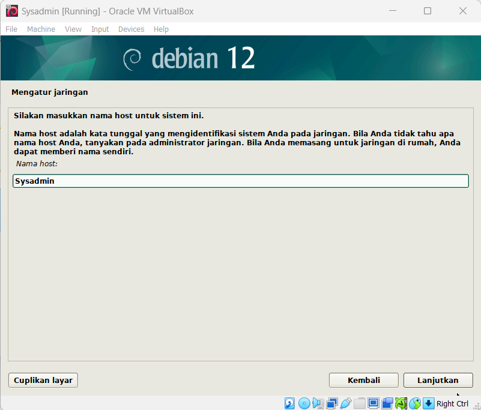
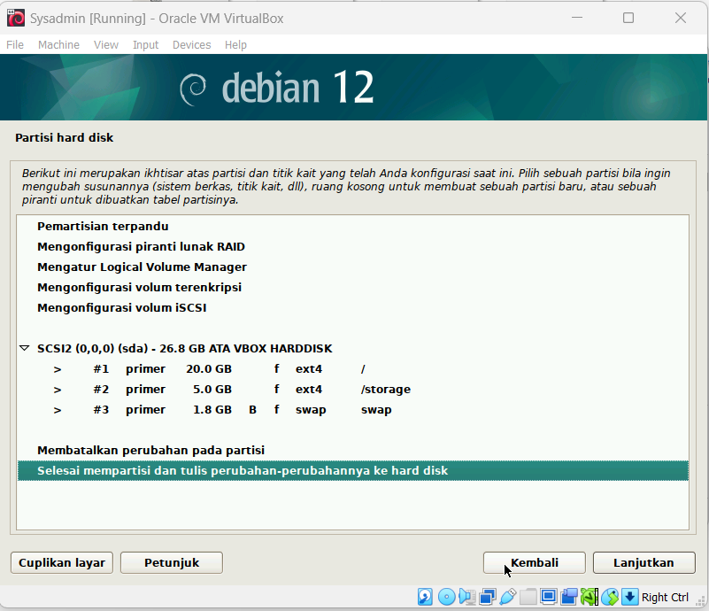
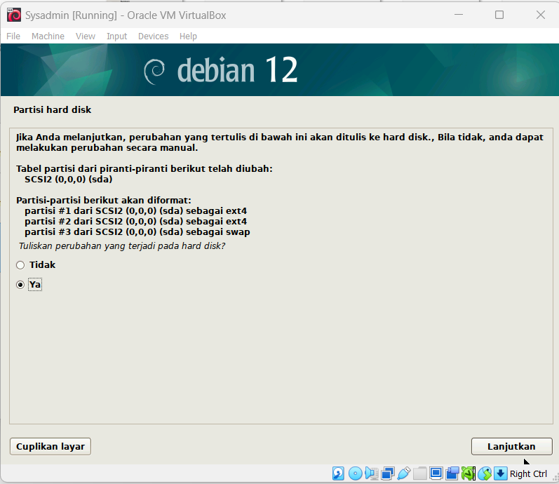

# INSTALASI DEBIAN DI VIRTUALBOX 

1. Download [Virtual Box](https://www.virtualbox.org/wiki/Downloads) dan [Debian](https://www.debian.org/download) terlebih dahulu.
2. Install Virtual Box dan buka Virtual Boxnya.
3. Klik Icon + (Add) di kanan atas Virtual Box. Lalu isi ISO Image sesuai dengan path saat mendownload ISO Debian tadi. Lalu centang "Skip Unattended Installation" agar kita bisa secara manual mengonfigurasi Debiannya.

.png)

4. Lalu buat memory (RAM) sebanyak 4GB. Dan untuk prosesornya di sini saya memilih 4 cores.

.png)

5. Buat storagenya sebanyak 25GB.

.png)

6. Akan muncul summary mengenai Machine Name, OS Type, Hardware, dan Disk. Cek dulu dan pastikan bahwa sudah sesuai dengan apa yang kita inginkan lalu klik Finish.

.png)

7. Lalu start debiannya dan akan muncul installer menunya. Klik Graphical Install.

.png)

8. Setelah itu kita akan diarahkan untuk mengonfigurasi lokasi, keyboard, dan bahasa.

.png)
.png)
.png)
.png)
.png)
.png)
.png)

9. Di sini kita akan mengonfigurasi networknya. Isi hostname dengan format "sysadmin-NRP". Lalu domainnya dikosongi saja.

.png)

10. Setelah itu konfigurasi untuk informasi user.

.png)
.png)

11. Lalu kita akan mengonfigurasi partisi disknya. Pilih manual. Untuk partisinya sebagai berikut:
- 20GB, beginning, primary, ext4, mount point: /
- 5GB, end, primary, ext 4, mount point: /storage
- 1.8GB, end, logical, swap area.

.png)
.png)
.png)

12. Kita akan masuk ke finalisasi instalasinya. Pilih "no" untuk scan more media. Pilih lokasi "Indonesia" dan untuk mirrornya bisa pilih "deb.debian.org" atau yang terdekat dari lokasi kita sekarang. Untuk http proxy dikosongi saja. Dan untuk software selection, saya menambah centang Web Server dan SSH Server.

.png)
.png)
.png)
.png)
.png)
.png)

13. Tunggu instalasi hingga selesai. Nanti akan muncul konfigurasi Boot Loader, pilih Yes. Tunggu beberapa saat, lalu instalasi Debian sudah berhasil.
