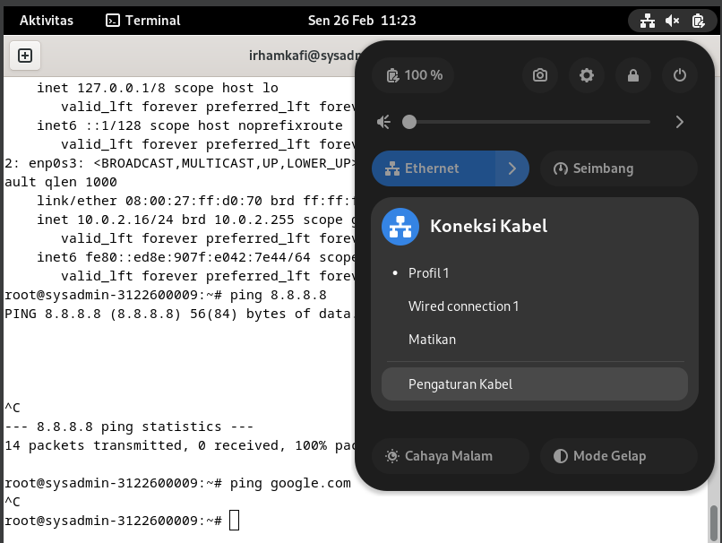
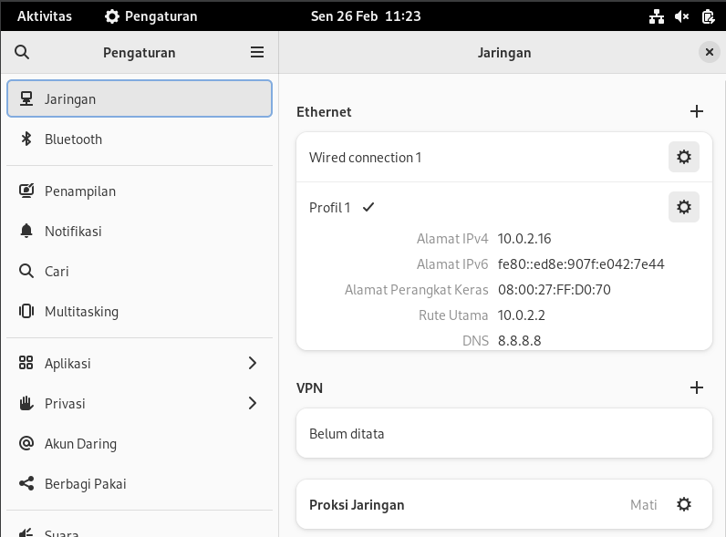
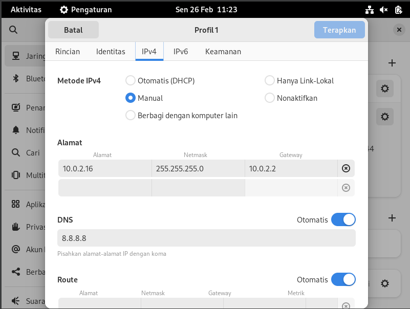
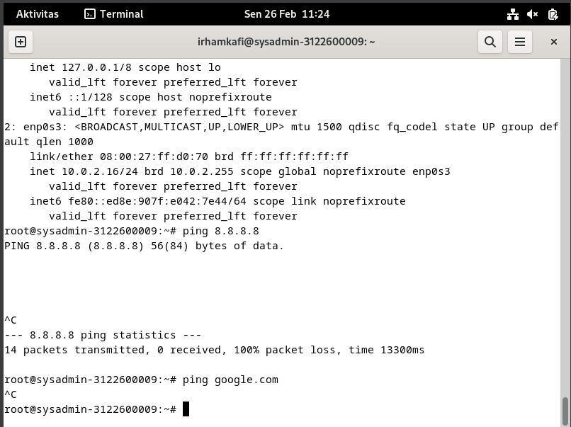
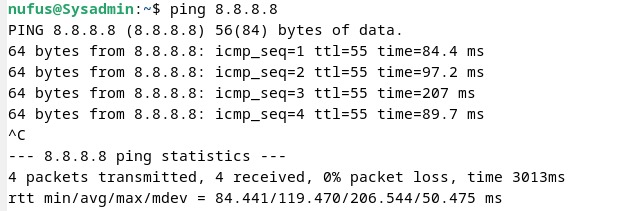
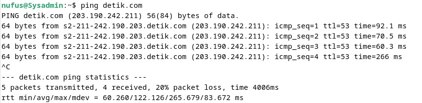
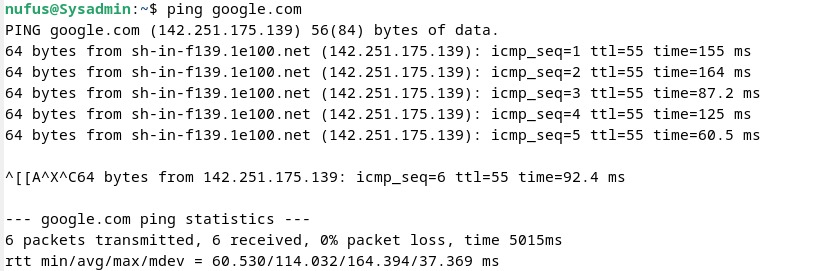

DHCP (Dynamic Host Configuration Protocol) adalah protokol jaringan yang digunakan untuk secara otomatis mengonfigurasi perangkat dalam suatu jaringan IP. Protokol ini memungkinkan perangkat untuk secara dinamis mendapatkan alamat IP, subnet mask, gateway default, server DNS, dan konfigurasi jaringan lainnya dari server DHCP dalam jaringan.

### 1. ke wired

    

tekan pengaturan kabel

### 2. tambah wired/ethernet

    

tekan ikon tambah yang berada disamping ethernet

### 3. setting wired

    

menuju ke IPv4 terus pilih bagian manual masukan alamat terserah anda. jangan lupa isi dns. disini contoh alamat 10.0.2.16 dengan netmask 255.255.255.0 dan gateway 10.0.2.2 menggunakan dns 8.8.8.8

### 4. uji coba

    

cek ip di terminal menggunakan command ip addr jika muncul alamat ip sesuai dengan alamat yang dimasukan maka anda hanya perlu mengecek apakah terhubung ke dns 8.8.8.8

ping ke 8.8.8.8:

    

ping ke detik.com:

    

ping ke google.com:

    

