# Mail server

1. konfigurasi db.kelompok5.local

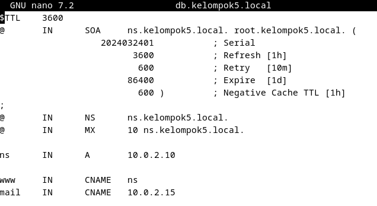

2. Konfigurasi db.kelompok1.local.inv.

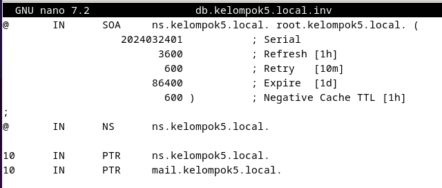

3. jalankan nslookup mail.kelompok5.local

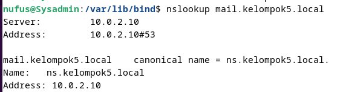

4. Install systemd-timesyncd untuk Network Time Protocol.

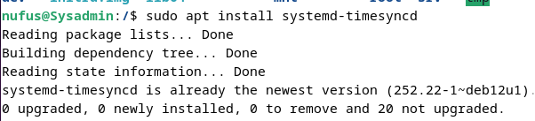

5. Set timezone ke Jakarta, ntp true, dan local rtc false.

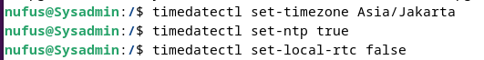

6. Konfigurasi file timesyncd.conf di /etc/systemd dan ubah pool menjadi yang paling dekat agar delaynya pendek.

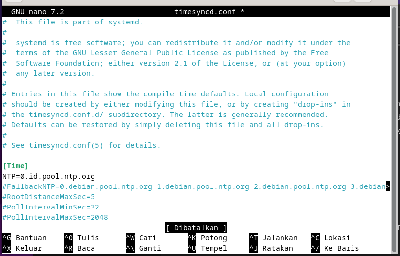

7. Restart service dan cek statusnya.

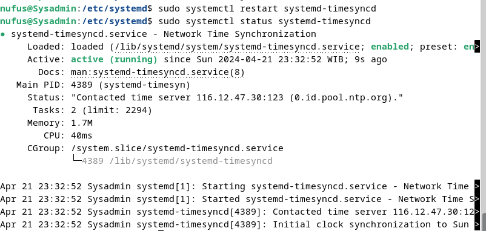

8. Cek tanggalnya.

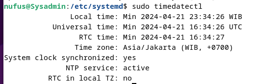

9. Install Apache 2.

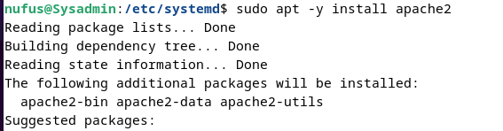

10. Ubah ServerTokens menjadi Prod.

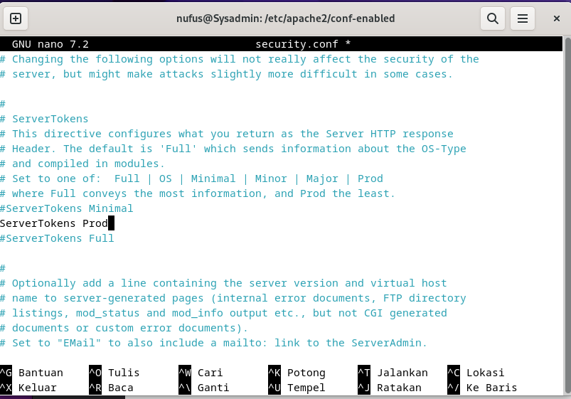

11. Tambahkan ServerName sesuai kelompok.

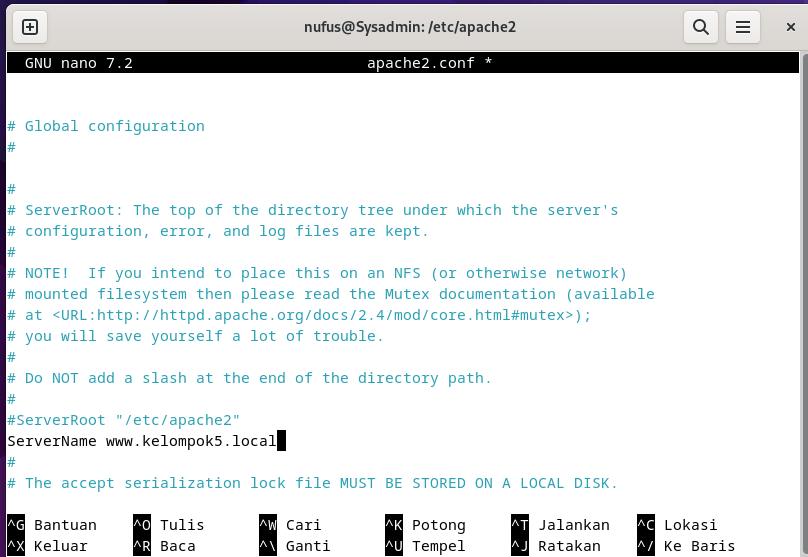

12. Ubah ServerAdmin sesuai kleompok.

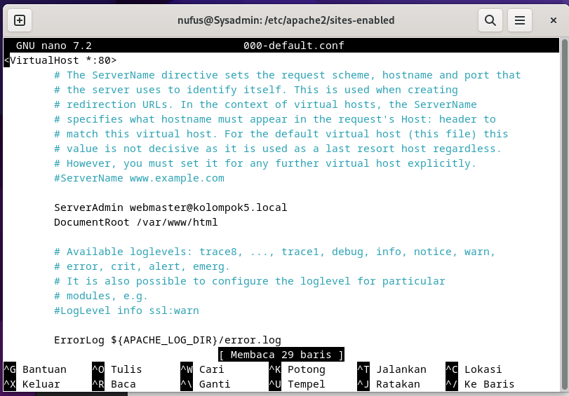

13. Reload Apache.

14. Cek apakah webserver berhasil berjalan.

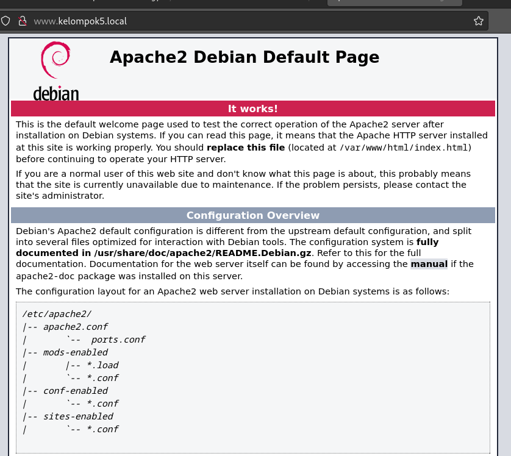

15. Install PHP dengan `sudo apt -y install php8.2 php8.2-mbstring php-pear`

16. Install PHP FPM dengan `sudo apt -y install php-fpm`.

17. Konfigurasi file default-ssl.conf.

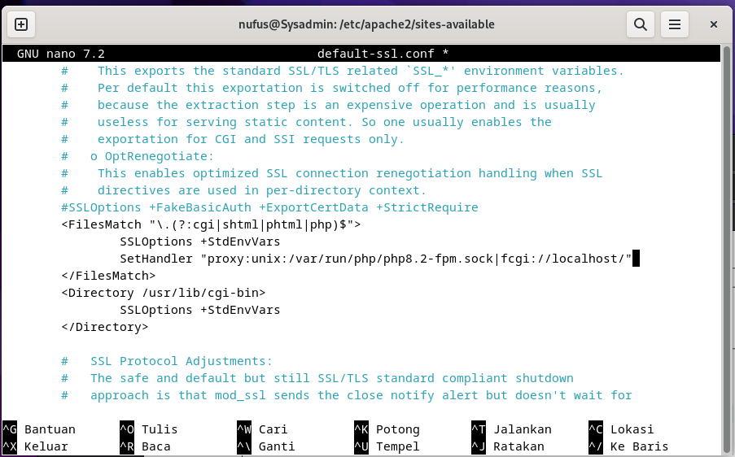

18. Lakukan setenvif di ae2enmod proxy_fcgi dan load confignya.

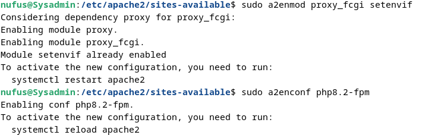

19. Restart servicenya.

20. Install maria db dengan `sudo apt -y install mariadb-server`

21. Ubah charset ke utf8mb4 di file `/etc/mysql/mariadb.conf.d/50-server.cnf`, lalu restart mariadb.

22. Jalankan sudo mysql_secure_installation.

23. Install sudo nano apt -y install postfix sasl2-bin lalu pilih No Configuration.

24. Copy file config /usr/share/postfix/main.cf.dist ke /etc/postfix/main.cf

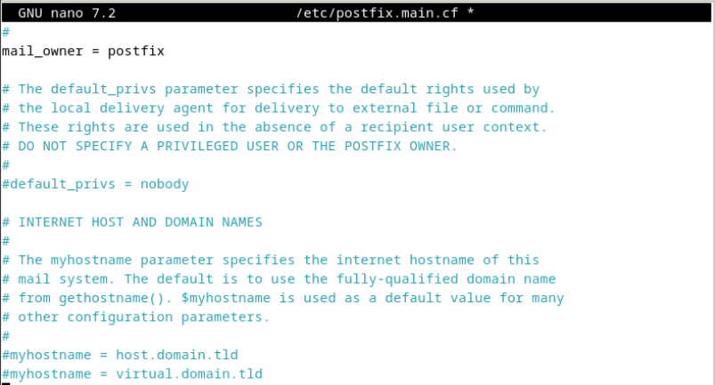
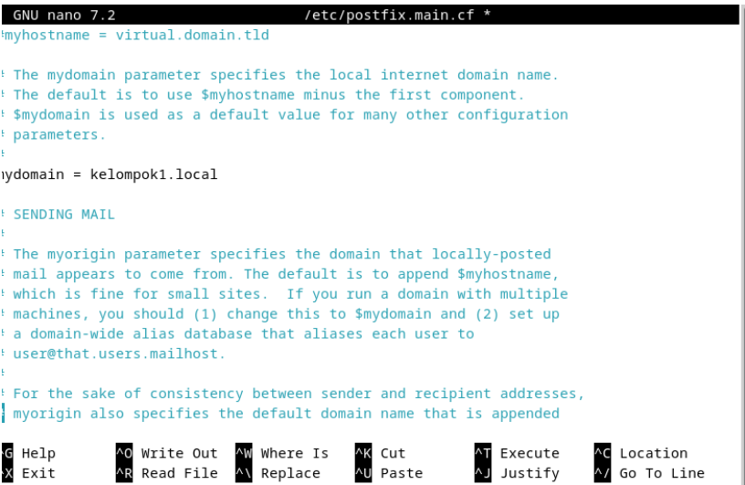
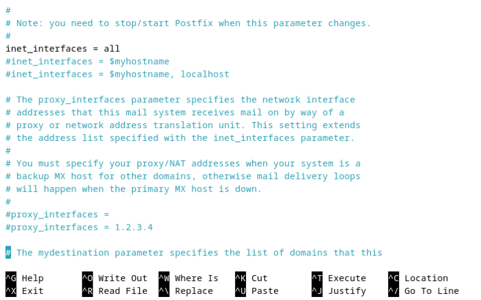
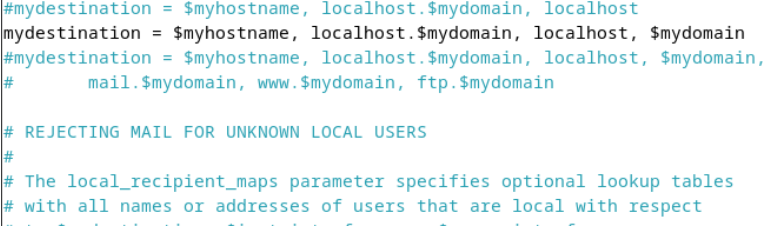
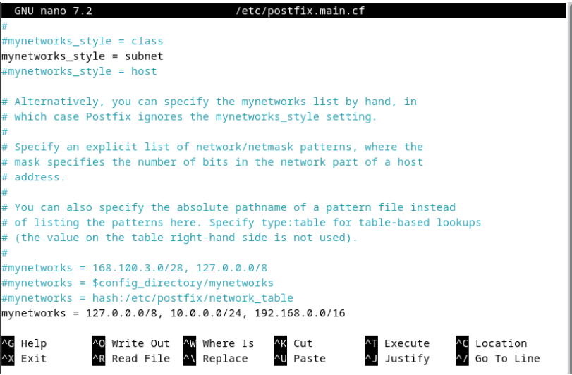
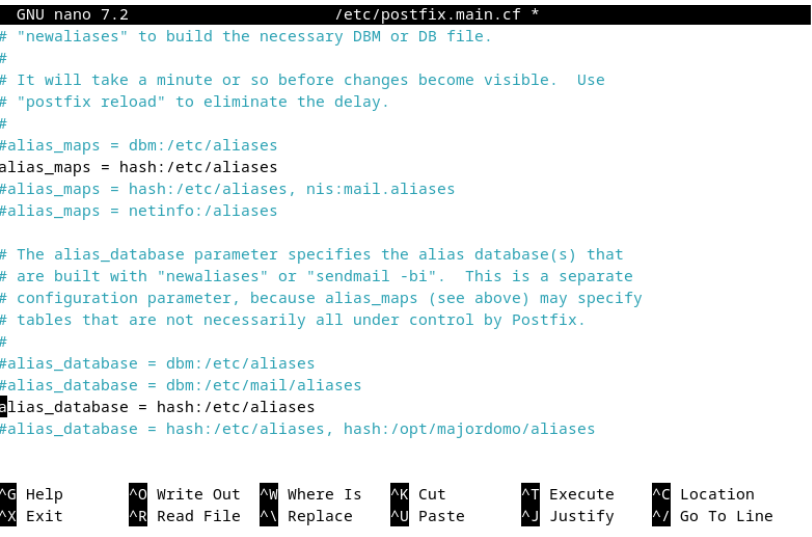

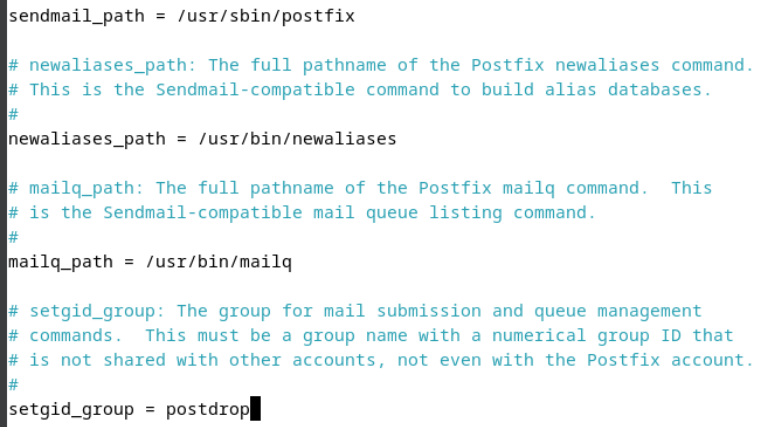
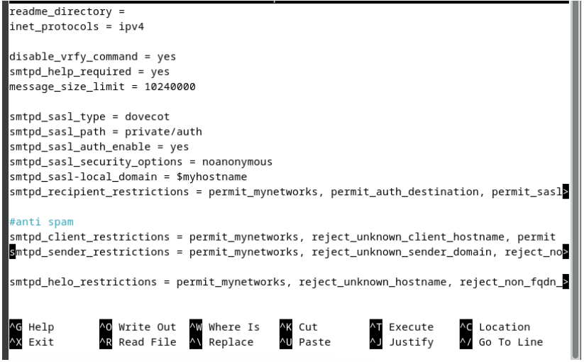
